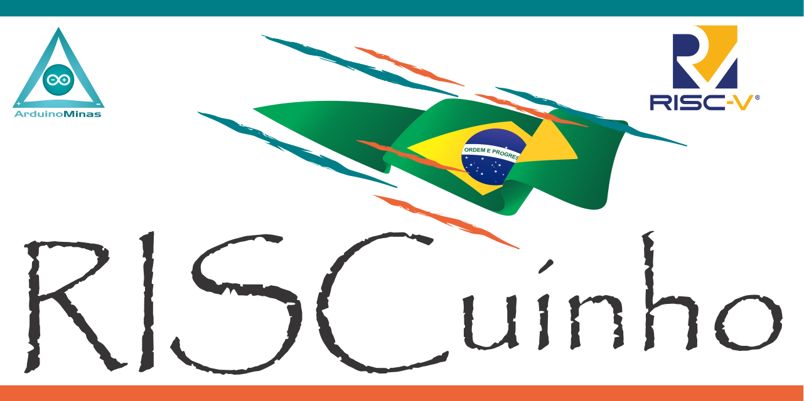

**RISC**uinho - A scratch in the possibilities in the universe of microcontrollers
=====================================

**RISC**uinho (Risquinho), in portuguese is a small scratch on the surface of something, and this represents the proposal of this project that starts in a very didactic way, doing the minimum necessary by scratching the surface of what can be done with a Core or multiple RISC Cores.

This project is educational and aims at my study on microprocessors and to teach my introductory courses on microprocessor programming and architecture at [Arduino Minas (Curso Maker/Geringonça Maker Space)](https://facebook.com/CursoMaker). RISCuinho (Risquinho) will also be used for my RTOS studies when it is possible to multiply its core to simulate multicore microcontrollers.

I am a autodidata student I do not have a computer science course and no course that gives me the basis to create such a microcontroller, however I am graduated in Computer Network Design and Implementation, I have some programming courses, Project Management and other related areas, I used to create it was through studies of specialized books such as those discussed in the bibliography section and on websites on the internet.

All this material was assimilated with the help of conversations in the [RISC-V Brasil group on Telegram](https://t.me/riscvbr), where participants from different areas related to IT and exchange experience on microprocessors and microcontrollers, some renowned professionals in the sector, which I am very grateful in the sector, in particular:

 * Marcelo Samsoniuk (@samsoniuk) [Core Risc DarkRiscv](https://github.com/darklive/darkriscv) 
 * Paulo Matias (@thotypous) 
 * Lucas Teske (@racerxdl) [Core RISC RISCow](https://github.com/racerxdl/riskow)
 * Marcus Medereiros (@zxmarcos) [Core RISC Riscado-V](https://github.com/zxmarcos/riscado-v)
 * Jecel Jr

I will use Portuguese as the official language of this project, but English can also be used for requests for information and suggestions.

---

Eu usarei o português como idioma oficial deste projeto, porém o inglês também pode ser usado para solicitações de informações e sugestões.

## Arquitetura do Microcontrolador

O **RISC**uinho (Risquinho) usa aa Arquitetura Havard simples, com a memória de programa espelhada no endereço de memória de dados, para que possa ser reprogramada a aquente e demonstrar recursos modernos de microcontroladores que possuem tal recurso, isso será discutido futuramente em documentação apropriada.

O **RISC**uinho possui 32 registradores conforme a especificação RV32I. Possui todas as intruções básicas para operação com numeros inteiros implementadas. Ele não possui instruções de Sistema, Sincronismo e Controle implementadas nesta versão.

O **RISC**uinho também é um core de um 3 estágio de um único ciclo de clock, em versões futuras será desenvolvido um pipeline mais complexo.

## Exemplos

A pasta [examples](./examples) possui exemplos para testes, na sua maioria obtidos no curso oferecido pela [Vicilogic][https://www.vicilogic.com/], tais exemplos podem ser obtidos no link [https://www.vicilogic.com/vicilearn/run_step/?s_id=1452](https://www.vicilogic.com/vicilearn/run_step/?s_id=1452)

## Simulação

As Simulações estão sendo feitas com IVerilog no Windows 10 com WSL, a condificação é feita no VSCode, e a verificação dos sinais gerados com GTKWave.

As instruções são testadas tanto no ambiente Vicilogic como no simulador [emulsiV](https://carlosdelfino.eti.br/emulsiV)

## Quartus

Estou usando o Quartus 20.4 Prime Lite Edtion para fazer os testes em uma placa De0-nano.

## De0-Nano

Placa de prototipação e estudos da Terasic.

Estou usando a De0-nano versão 1.6:

 * FPGA: Altera Cyclone IV EP4CE22FE22F17C6N
